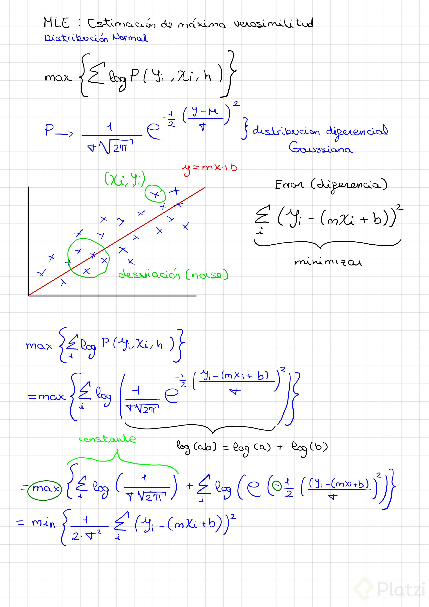
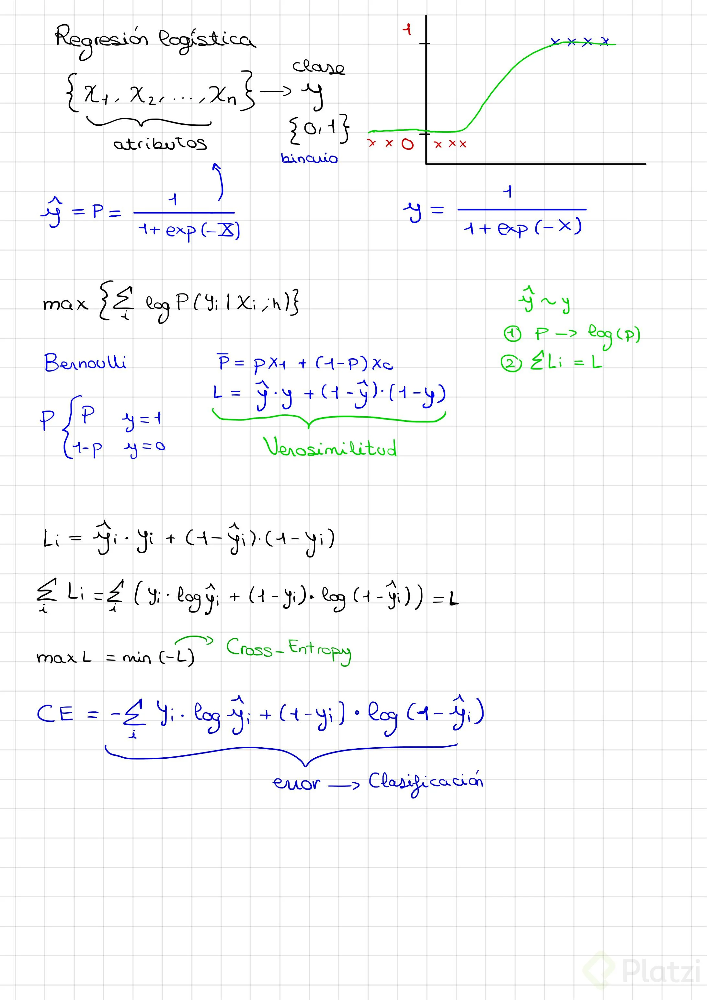

# Curso de Matemáticas para Data Science: Probabilidad

## Incertidumbre y probabilidad

### ¿Qué es probabilidad?

La probabilidad siempre se usa en donde hay incertidumbre, es decir, hay que tomar decisiones con información incompleta. Los juegos de azar son un perfecto ejemplo de esto, porque no podemos predecir el resultado. Hay un grado enorme de complejidad con muchas variables en juego que se vuelve imposible predecir qué sucederá.

> El azar no es más que la medida de nuestra ignorancia. Los fenómenos fortuitos son, por definición, aquellos cuyas leyes o causas simplemente ignoramos. - Henri Poncairé

El azar se debe a nuestra incapacidad de tener toda la información suficiente sobre un problema específico o una situación de la realidad particular.

En matemáticas: la probabilidad es un lenguaje que nos da herramientas para cuantificar la incertidumbre.

### Axiomas de la probabilidad

Estos son enunciados que asumimos como verdad y no requieren demostración.

$$P = \frac{N° Sucesos exitosos }{N° Sucesos totales}$$

Hay 2 tipos de pensamientos en la probabilidad:

- Frecuentista: Hacer infinitos intentos para acercanos a los resultados.
- Bayesiana

Hay 2 tipos de sucesos:

- Suceso elemental: Es algo muy básico que no tenemos que probar.
- Suceso: está formado por varios sucesos elementales.

### Espacio muestral

Aquí están todas las posibles ocurrencias de un evento aleatorio.

### Axiomas

$$0 \le P \le 1$$

$$certeza \rightarrow P = 1  $$

$$imposibilidad \rightarrow P = 0$$

$$disjuntos \rightarrow P(A⋃B) = P(A) + P(B) $$

**Son eventos disjuntos porque es imposible que ocurran al mismo tiempo.**

¿Qué es realmente la probabilidad? Es una creencia que tenemos sobre la ocurrencia de eventos elementales.

### Probabilidad en Machine Learning

#### Fuentes de incertidumbre

- Datos: Recoger datos con instrumentos de medición no es algo perfecto, todos tienen un margen de error.
- Atributos del modelo: aquí tenemos subconjuntos reducidos de toda la realidad del problema.
- Arquitectura del modelo: en matemáticas un modelo se entiende como "una representación simplificada de la realidad".

*El uso de etiquetas en machine learning quiere decir que es un entrenamiento supervisado.*

Cuando tu modelo está bien entrenado entonces ya puede hacer predicciones.

Todas las etapas de un modelo, en ciertos aspectos, involucran probabilidad.

Lo primero que haremos en la parte del entrenamiento es escoger un modelo precisamente para entrenar a la computadora. Aquí decidimos si el modelo usará probabilidad o no, ya que *no todos los modelos usan probabilidad*.

***MLE: Maximum likelihood estimation*** (estimación de máxima verosimilitud), es un técnica probabilística.

#### *Es muy importante tener el cuenta que*

##### Entrenamiento

- La arquitectura determina si es probabilístico o no.
- Los parámetros son para decir cómo se va a entrenar a la computadora para que el error sea el menor posible.
- Hiper-parámetros es de todas las posibles arquitecturas del modelo, escoger cuál de todas funciona mejor.

##### Predicción

Aquí hay una interpretación del modelo, la persona debe saber mucho de cómo funciona el cálculo de probabilidades del modelo para obtener una correcta interpretación del mismo.

### Tipos de probabilidad

3 tipos de probabilidades:

- Conjunta (Joint): Por ejemplo, tenemos 2 dados y nos preguntan '¿Cuál es la probabilidad de que ambos dados caigan en número par?' En nuestro espacio muestral tenemos 36 posibilidades. Entonces $$P(par,par) = \frac{9}{36} = \frac{1}{4}$$ porque tenemos los resultados (2,2) , (2,4) , (2,6) , (4,2) , (4,4) , (4,6) , (6,2) , (6,4) y (6,6). Realmente estamos calculando dos probabilidades distintas y a esto se le llama joint.
- Marginal: Marginal es cuando obtienes una probabilidad sencilla a partir de una probabilidad conjunta. $$P(A) \rightarrow P(A,B)$$ $$P(A) = \sum P(A,B)$$
- Condicional: Por ejemplo, tenemos 2 dados y nos preguntan, '¿Cuál es la probabilidad de que A caiga en par, dado que B ya es par?'.  Aquí ya no tendremos el espacio de 36 posibilidades, tendremos solamente 18 porque son todas las posibilidades de las caras 2, 4 y 6 del dado B. Los resultados para A entonces serían (2,2) , (2,4) , (2,6) , (4,2) , (4,4) , (4,6) , (6,2) , (6,4) y (6,6). Entonces serían 9 como en el ejemplo de probabilidad conjunta. $$P(A=par | B=par) = \frac{9}{18}$$ Ahora hay que calcular la probabilidad de que B sea par, lo cual es $$P(B=par)=\frac{18}{36}$$ Ahora multiplicamos ambos valores, $$\frac{9}{18} \times \frac{18}{36} = \frac{9}{36} = \frac{1}{4}$$

#### Regla del producto

$$P(A,B) = P(A|B)P(B)$$

#### Probabilidad conjunta

$$P(A,B) = P(A\&B) = P(A∩B)$$

Es una probabilidad que considera la ocurrencia de diferentes pero simultaneos eventos aleatorios. Esta se relaciona con la probabilidad condicional por medio de la regla del producto.

#### Probabilidad condicional

$$P(A dado B) = P(A|B)$$

$$P(A∩B) = P(A|B)P(B)$$

***Las probabilidades condicionales no reflejan causalidad.***

#### Probabilidad marginal

Las probabilidades marginales se obtienen haciendo sumas de ciertas variables aleatorias o ciertas ocurrencias de las mismas dentro de la probabilidad conjunta.

### Ejemplos de cálculo de probabilidad

#### Correlaciones de eventos

- A = {el resultado de lanzar un dado es 4}

- B = {el resultado de lanzar un dado es par}

- C = {el resultado de lanzar un dado es impar}

$$P(A) = \frac{1}{6}$$

$$P(A|B) = \frac{1}{3} \gt \frac{1}{6}$$

Vemos que la probabilidad condicional de A y B es mayor que sólo la de A. Esto nos quiere decir que los eventos A y B están positivamente correlacionados.

C = {1,3,5}, {1,3,5}∩{4} = 0

$$P(A|C) = \frac{0}{3} = 0$$

Como la probabilidad condicional de C redujó drásticamente la probabilidad de sólo A, estos dos eventos están negativamente correlacionados.

***Que dos eventos sean excluyentes no quiere decir que sean independientes.***

$$Excluyente \ne Independiente$$

### Ejemplos avanzados con probabilidad

#### Paradoja ¿niño o niña?

- Una mujer tiene dos bebés donde el mayor es un varón.

- Una mujer tiene dos bebés donde uno de ellos varón.

A pesar de que ambos enunciados son muy iguales cambian mucho las probabilidades y aquí es donde se genera la paradoja.
Para el primer caso tenemos 1/2 de probabilidades, mientras que para el segundo es 1/3.

#### Paradoja de Monty Hall

Este vídeo ayuda con el asunto 

## Distribuciones de probabilidad

### ¿Qué es una distribución?

Para las probabilidades tenemos que usar el cálculo.

$$ X aletoria \rightarrow P(X = x) $$
$$ P=f(X) $$

Una distribución de probabilidad es una función que coge una variable aleatoria y a cada uno de sus posibles estados dentro del espacio muestral le asigna una probabilidad.

Hay una convención en el campo de la probabilidad.
X -> variable aletoria (letras mayúsculas)
x -> valores posbiles en el espacio muestral (letras minúsculas)

- Dominio: todos los valores posbiles de la variable aleatoria sobre los cuales la función puede ser calculada. Estos dominios pueden tener conjuntos discretos o continuos.

  - $$ Discreto: \{1,2,3,4,5,6\} $$
  - $$ Continuo: [0 , \infty] $$

¿Cuál es la integral de una distribución?

$$P(X \le x) = \int P(X)dx = C(X)$$
El área debajo de la curva, o sea, la integral.
C(X) es la función de probabilidad acumulada.
Esto funciona muy bien con valores continuos.

Pero para los casos discretos se verá más bien como un histograma.
Para estos casos discretos es mejor usar una sumatoria.

$$ P(X \le x) = \sum P(X) $$

La probabilidad depende muchísimo del cálculo.

$$ P(a \le X \le b) = \int_a^b P(X)dx = P(b) - P(a) = C(X) $$

### Distribuciones discretas

#### Distribución de Bernoulli

Variables con ocurrencias binarias
$$ P(X=1) = p $$
$$ P(X=0) = 1-p $$

#### Distribución binomial

Secuencia repetitiva de eventos tipo Bernoulli

$$ P(k,n)  = ?$$
Se llama combinatoria

$$ {n \choose k}  = \frac{n!}{k!(n-k)!} $$

$$ P(k \ caras|n \ lanzamientos) = P(k;n,p) $$
$$ P(k;n,p) = {n \choose k} p^k (1-p)^{(n-k)} = \frac{n!}{k!(n-k)!} p^k (1-p)^{n-k}$$

#### Distribución multinomial

$$ P(X_1 , ... , X_n) = \frac{n!}{k_1!...k_2!} p_1^{k_1} ... p_n^{k_n} $$

#### Otras distribuciones discretas

- Poisson
- Geométrica
- Hipergeométrica
- Binomial negativa

### Usando la distribución binomial

Consultar [estos apuntes](https://colab.research.google.com/drive/14tJ0Xp-ekBuC5YE05GPluyZXSkCY6_d5#scrollTo=RKWCpT-r1M1E)

### Distribuciones continuas

Esto es cuando las variables pueden tomar valores no necesariamente enteros y se vuelven mucho más complejos.
La distribución continua más famosa es la **Distribución normal (gaussiana) o camapa de Gauss**

$$ P(X) = \frac{1}{\sigma \sqrt{2\pi}} exp - \frac{1}{2} \left ( \frac{X - μ}{\sigma} \right ) ^2 $$

Para notas de esta clase, consultar [estos apuntes](https://colab.research.google.com/drive/1El_LAXxCTod_vfxkVenkKnu-ybmJk2FY#scrollTo=WkeeyVwO68xx)

Existen otras distribuciones continuas como:

- Exponencial
- Pareto
- Etc...

### ¿Cómo estimar una distribución?

 Consultar para esta clase [estos apuntes](https://colab.research.google.com/drive/1fo_ghXw18Lw8CZ-kgKKhobEtDZz3ha1l#scrollTo=Rfb0WVdFM-DO)

La **estimacion paramétrica** consiste en suponer una función para la distribución y ajustar los parámetros de los datos a dicha distribución. Por otro lado, la **estimación no paramétrica** se aplica cuando los datos no se ajustan a ninguna distribución conocida.
En la estimación no parametrica, se usan parametros diferentes, en este caso (el del vídeo de Platzi y los apuntes de colab) con Kernel se usa un parametro de suavizado y una forma de distribución base.

## MLE (Maximum Likelihood Estimation)

### ¿Qué es MLE?

Estimación de máxima verosimilitud. Es un framework para estimación de densidades de probabilidad.

#### Elementos de MLE

- Escoger la distribución: Teniendo solo una muestra de los datos.
- Escoger los parámetros de la distribución: Que mejor ajustan la distribución a los datos.

MLE es un problema de optmización

$$ P(X;θ) = L(X;θ) $$

$$ maxL(X;θ) \rightarrow max Π_i P(X_i;θ) $$

$$ max \log L(X;θ) \rightarrow max \sum_i \log P(X_i;θ) $$

El problema con la segunda línea es que se multiplican probabilidades muy pequeñas y esto hace que el producto sea cada vez más pequeño, haciendo que las computadoras dejen de calcular desde cierto punto, a esto se le llama *underflow*.

Entonces lo que se usa computacionalmente es el logaritmo y una sumatoria para justamente evitar el underflow, haciendo una suma de números negativos relativmanete grandes.

### MLE en machine learning

MLE en machine learning se trata de ajustar densidades a datos.

Regresión lineal con MLE

$$y= mx+b=b_0 x + b_1 $$

Donde:

- m : pendiente
- b : intercepto
- b sub 0 : weight
- b sub 1 : bias

$$ P(y|x) \rightarrow max \sum_i \log P(y_i|x_i ; h)$$

Donde:

- h : modelo

$$ h \rightarrow y = b_0 x + b1 $$

$$ P \rightarrow \frac{1}{σ \sqrt{2π}} exp - \frac{1}{2} \left( \frac{X-μ}{σ} \right)^2 $$

### Regresión logística

Cross-Entropy: Función de error que busca siempre minimizarse en un problema de clasificación binaria. Es una consecuencia de la estimación de Máxima Verosimilitud.

### Aplicación de regresión logística

Consulte para esta clase [estos apuntes](https://colab.research.google.com/drive/1k8wExt4AGUUQlEl77E0sG30FHhv5YP4A)

## Inferencia bayesiana

### Teorema de Bayes

$$ P(A|B) = \frac{P(B|A)P(A)}{P(B)} $$

### Bayes en ML

#### MAP vs MLE

$$ P(h|D) = \frac{P(D|h)P(h)}{P(D)} $$

Donde:

- h es hipótesis

- D son los datos

$$ \max P(h|D) \rightarrow \max P(D|h)P(h) $$

## Retos finales

### Tipos de probabilidad - ejercicios

Los diferentes tipos de probabilidades que existen con frecuencia generan algo de confusión, estos ejercicios te permitirán fortalecer el entendimiento de estos conceptos:

[ejercicios](https://colab.research.google.com/drive/1yQFCKo2GHtbJui0szPjLhAJSjpivBeun?usp=sharing)

### Distribuciones de probabilidad ejercicios

Luego de que entendemos que hay diferentes tipos de probabilidades, el concepto de distribución de probabilidad nos dice que podemos usar funciones matemáticas para mapear cada ocurrencia posible de una variable aleatoria a un número que es la probabilidad de esa ocurrencia.

En este conjunto de retos exploramos más a fondo el cálculo con distribuciones discretas, especialmente la binomial:

[ejercicios](https://colab.research.google.com/drive/10xbi88L6alsPC8-cec_6VuUeh7ttFaEF?usp=sharing)

Mientras que en este otro conjunto de retos exploramos más a detalle la distribución gaussiana como representante de las distribuciones continuas:

[ejercicios](https://colab.research.google.com/drive/1OVQ0fwQ1q1lPFjmjPHyuCkD58SZfm4o9?usp=sharing)

### Estimación de densidades de probabilidad ejercicios

Uno de los métodos más importantes para estimar densidades de probabilidad es el MLE (Maximum Likelihood Estimation), del cual podrás profundizar en este reto:

[ejercicios](https://colab.research.google.com/drive/19F8F0ID9ErtiHUNbWsOIJ7f22u7jjS0d?usp=sharing)

### Teorema de Bayes y machine learning

Finalmente, encontrarás en la siguiente notebook un ejemplo donde se profundiza el desarrollo de un clasificador de Naive Bayes. Aquí verás por qué es importante el uso de distribuciones iniciales para ajustar las verosimilitudes con el fin de poder aplicar tus modelos a datos que no estaban en el dataset original de entrenamiento:

[ejercicios](https://colab.research.google.com/drive/1XbQ6-5Ax8Pksik2MR2kWB87ay85RMX2b?usp=sharing)
